# 3D Semantic Segmentation

This repository contains all the necessary code, example and explanation for Open3d-ML GSOC 2022 Coding Challenge.
Note: All the main files are in the `src` folder, `model_adding.py` is for putting the odel inside Open3D-ML library's models folder and `open3d_semseg.ipynb` is similar to what I have done with the files in `src`, but via Jupyter notebook. Jupyter notebook is mainly for quick overview and see the process, but it doesn't contain the tensorboard or code for data point cloud (it was making the kernel stop working). The main part with the complete task with all the necessary documentation, typing, implementation, visualization are in `src` folder.

---

## Table of Contents

- [Requirements](#requirements)
- [Data and Code Explanation](#data-and-code-explanation)
- [How to run the Code](#how-to-run-the-code)
- [Model Summary and Results](#model-summary-and-results)
- [Model Adding](#model-adding)

---

## Requirements

As a programming language, [Python3.8](https://www.python.org/downloads/release/python-380/) has been used. Besides the built-in Python packages, the following libraries have been installed for training and visualization purposes:

- [Numpy](https://numpy.org/)
- [Matplotlib](https://matplotlib.org/)
- [PyTorch](https://pytorch.org/)
- [Open3D](http://www.open3d.org/)

To install all the necessary packages, you can run the code below in the terminal:

```bash
pip install -r requirements.txt
```

It is recommended to use a virtual environment, if you do not know how to use it, follow the instructions below.

### Creating virtual environment and preparing the requirements

If you do not have a pip installed with your python, run the code below in the terminal, first update the packages, insall the pip and upgrade to the lastest version:

```bash
sudo apt-get update
sudo apt install python3-pip
python3 -m pip install --upgrade pip
```

Then before creating a virtual environment, we need to install Python venv package:

```bash
sudo apt install python3.8-venv
```

Now we can create the virtual environment, I will create it my current directory with named 'env', you can give a path of your choice with different name:

```bash
python3 -m venv env
```

After creating our virtual environment, we need to tell our computer that we want to use python from the virtual environment, and all the packakges should be read from there, not from global python installed in our computer, so we should activate the virtual environment:

```bash
source ~/env/binb/activate
```

Note that I had created the virtual environment 'env' under the home directory, if you have created in anywhere else, you should give that path. Lastly, we can install the requiremnts in our virtual environments:

```bash
pip install -r requirements.txt
```

## Data and Code Explanation

The dataset is a processed scenes of the Stanford 3D Indoor Scene Dataset. Given dataset has 111620 samples with 7 columns, where first 3 are x, y, z positions of input points, next 3 columns are R, G, B values and last column is a target class which is 0-12. But given dataset has no example of class 3. The task is building simple Deep Neural Network using Sparse Convulution and ReLU layers to build an encoder and Sparse Convolution Transpose and ReLU layers (ReLu excluded for the last layer) to build an decoder and this encoder-decoder architecture should classify the data points into one of the 13 classes. If you love to see the proces while coding, you can look through the `open3d_semseg.ipynb` notebook. Or you can analyze the task as a project. For that purpose, our actual training file is `semseg_train.py`, but to prepare our dataset and model for trainign nicely and visualize the results, `dataloader.py`, `semseg_model.py` and `visualize.py` files have been created. Let's analyise their purposes to have a better understanding.

### Dataloader.py

Instead of training all the examples all in once as per epoch, it has been proven that using batches of training examples to train the model leads much better results with schotastic gradient decent algorithm and also it is computationally relevant. Since I am using PyTorch, I need to use PyTorch DataLoader to take advantage of batch learning. Therefore I have creatd `dataloader.py` file, where I have two classes, one for creating a custom Dataset based on our input and output tensors, where input tensorf are input features and positions together, and output is target class. Then in custom data loader class, I create an instance of my custom dataset and pass the input/output tensors then give the result to the DataLoader with corresponding `batch_size`, and `shuffle` parameters. It is straightforward that batch size is how many samples we want in each batch and shuffle argument is a boolean, if set to `True`, then before creating the batches training data will be shuffled, which is recommended to avoid the issue that all samples belong to the same class can come in sequence.

### Semseg_model.py

After preparing the data, we need a model to train, so `semseg_model.py` containes a class to create our model. Since we are using 3 SparseConv and 3 SparseConvTranspose layers, we should define number of filters for each layer, I control it with `kernel_size` argument which receives list of 3 integers. We also need to know how many channels we have in our input data to define our first layer properly, so I use `in_ch` argument for this purpose. Then for each filter, we should define which size of kernels we want. For consistency, the same kernel size has been used throughtout the network and it can be modified via `kernel_size` argument, which is list of 3 integers. Lastly, we can define the vocal size for our layers, by manipulating the `voxal_size` argument. For given task, I start by 0.02 and increase by a factor of 2 at each layer of encoder, then halve at each layer of the decoder.

### Semseg_train.py

In this file, I first use a function to allow the user train the model by passing the arguments while running the code, to avoid any hardcoding. Then I a Trainer class with 2 functions, one to use my data loader class to prepare the data for training that returns DataLoader, and the other one to create a model instance with corresponding arguments and start training over each epoch based on the batch size. To monitor the training, I print the accuracy and loss after each 400 batches, also after each epochs store the accuracy and loss for visualization of the results after the training. Besides, training loss and accuracy also added to the tensorboard. Training function returns a tuple of our model and history which is a dictonary containing training loss and accuracy

### Visualize.py

After having our model trained, we always want to see the changes over epochs, so in this file I have crated a class that has 2 functions, one take the history, destination path and dpi values as arguments, takes training accuracy and loss to plot and save the resultant figure at passed destination path with given dpi.
The other function is to compare the data points cloud based on their positions with given input positions and predicted values.

## How to run the Code

As I mentioned in the explantion of the `semseg_train.py`, I have allowed users to run `semseg_train.py` from the terminal by passing necessary arguments to manipulate how to train the model. Let's first look at the all possible arguments with their explanations (help), then go through them one by one:

```bash
usage: semseg_train.py [-h] --datapath DATAPATH --in_ch_size IN_CH_SIZE [--batch_size BATCH_SIZE] [--epochs EPOCHS] [--shuffle]
                       [--lr LR] [--filters_list FILTERS_LIST [FILTERS_LIST ...]] [--kernel_size KERNEL_SIZE [KERNEL_SIZE ...]]
                       [--plot_training] [--plot_destination PLOT_DESTINATION] [--dpi DPI] [--plot_point_cloud]
                       [--voxel_size VOXEL_SIZE]

Model Training Program.

required arguments:
  --datapath DATAPATH   path to the training data.
  --in_ch_size IN_CH_SIZE
                        channel size of the input features.

optional arguments:
  -h, --help            show this help message and exit
  --batch_size BATCH_SIZE
                        size of each batch for training.
  --epochs EPOCHS       number of epochs to train.
  --shuffle             pass it without any values to shuffle train data before splitting into batches (recommended to shuffle).
  --lr LR               learning rate for the optimizer.
  --filters_list FILTERS_LIST [FILTERS_LIST ...]
                        list containing filter sizes for hidden layers.
  --kernel_size KERNEL_SIZE [KERNEL_SIZE ...]
                        kernel size for the filters
  --plot_training       pass it without any value to draw training loss and accuracy.
  --plot_destination PLOT_DESTINATION
                        if you have passed --plot_training argument, use this flag with corresponsing path to store the plot.
  --dpi DPI             if you have passed --plot_training argument, use this flag to define dpi value to store the plot.
  --plot_point_cloud    if passed without any value, point cloud will be visualized.
  --voxel_size VOXEL_SIZE
                        starting voxel size for training.
```

First of all we have required and optional arguments, `datapath` is where your training data is stored, and `in_ch_size` is the number of channels input data has. So you should pass these arguments with relevant values to train the model. The rest of the arguments are optinal with default values. To manipulate the training you can pass the different values for each argument.

- batch_size - it is how many sample you want at each batch, default is 32 due to make computation easy

- epochs - number of epochs you want to train, default is smaller - 10, due to the computation again

- shuffle - if this argument not passed it will be used as False, if you want to set it True, use it without any value and it will shuffle training examples before the splitting into batches (shuffle is recommended)

- lr - learning rate for the Adam optimizer, default is 0.001

- filters_list - this a list of filters defining the number of filters you want at each layer, since our model is 3 layer encoder and 3 layer decoder, I use list of 3 integers. Encoder - increasing manner, Decoder - decreasing manner. Default is [16, 32, 64]

- kernel_size - it is a size of kernel you want at each layer, for consistency I use the same size and default is [3, 3, 3]

- plot_training - if this argument passed (you don't need to pass any value), training loss and accuracy will be plotted and stored at plot_destination with corresponding dpi value. If not passed, then default is False

- plot_destination - if you have passed plot_training argument, you can give a path to determine where to store the plot. Default is the under parent directory.

- dpi - if you have passed plot_training argument, you can determine dpi value to store the plot. Default is 300

- plot_point_cloud - if this argument passed (you don't need to pas any value), it will plot the data point clouds once with input positions and also with predictions

- voxel_size - you can manipulate the starting voxal_size for the layers of the network. It will be doubled through the Encoder, and halved in the Decoder. Default is 0.02 based on the task

Here is the sample code you can run in the terminal to train your model. Keep in mind that, datapath value I give is specific to my case, you should give the path to your own data.

```bash
python3 semseg_train.py --in_ch_size 3 --datapath '/mnt/c/Users/user/Desktop/data.npy' --plot_training --dpi 200
```

## Model Summary and Results

### Architecture of the Model

```bash
SemSeg(
  (conv1): SparseConv(
    (fixed_radius_search): FixedRadiusSearch()
  )
  (conv2): SparseConv(
    (fixed_radius_search): FixedRadiusSearch()
  )
  (conv3): SparseConv(
    (fixed_radius_search): FixedRadiusSearch()
  )
  (deconv1): SparseConvTranspose(
    (fixed_radius_search): FixedRadiusSearch()
  )
  (deconv2): SparseConvTranspose(
    (fixed_radius_search): FixedRadiusSearch()
  )
  (deconv3): SparseConvTranspose(
    (fixed_radius_search): FixedRadiusSearch()
  )
)
```

### Interpreting the results

Below is the visuaization of the training loss and acuracy. But unfortunately, to show the visualizations of input and predicted data points, Linux based Cloud terminals, like Google Colab failed to show. I realized the it is also one the summer of code tasks to make open3d visualizations work on google colab. My computer is currently Windows based because of my university (we still have online exams and I should use Safe Exam Browser which is not supported on Linux). Therefore I have to use Windows. For this project, I used WSL2 on Windows, but it doesn't plot anything. I searched on the internet, graphics is very common problem with WSL2, I tried a lot of solutions suggested on the internet, like Installing X server, enabling VcXsrv Inbound Rules from FireWall, adding code to bashrc to allow wsl2 to take ip automatically:

```bash
export DISPLAY=`grep -oP "(?<=nameserver ).+" /etc/resolv.conf`:0.0
```

But none of them worked, even matplotlib plotting didn't show up, I used Jupyter Notebook with `%matplotlib inline` to show the accuracy and loss, but then tried the open3d visualization for point data cloud, it made the kernel stop working. I also put the code at least to save the figure for plotting accuracy and loss for non-jupyter environment, but for open3d I couldn't find support for saving the figure. Still I have the code to visualize, and when I enable plotting the point cloud, it works without any problem with respect to the code, but the figure doesn't show up , some opening problem happens. I want to mention that, if  am selected if will not be an issue to work on the project, because until the summer my university will be finished, and I will switch back to the Linux. I generally use Ubuntu, as I mentioned above, due to the Safe Exam Browser problem for my exams I had to switch to Windows at the beginning of this Academic Year. Due to the memory, I couldn't dual boot or use Virtual Machine, and had to completely delete Linux and install windows, therefore I use WSL until the end of this semester, then get rid of the Windows.

Here is the message that visualization doesn't show up on WSL2:

```bash
FEngine (64 bits) created at 0x7f1fce840010 (threading is enabled)
FEngine resolved backend: OpenGL
Failed to open X display. (exiting)
```

### Loss and Accuracy plot

<p align="center">
  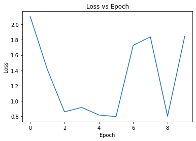
  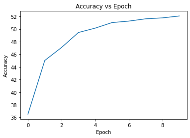 
</p>

### Tensorboard Plots - 5 Epochs

You can take the tensorboard log from src/runs under the project

### SparseConv Layer Biases

<p align="center">
  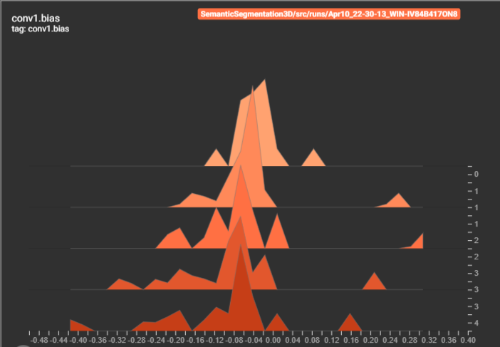
  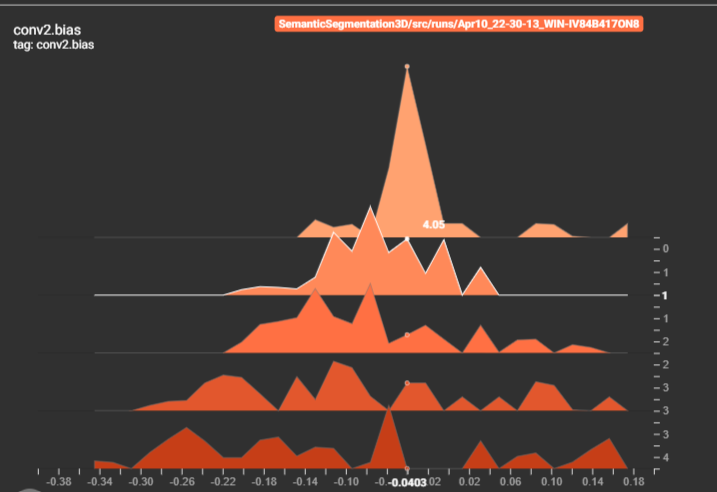
  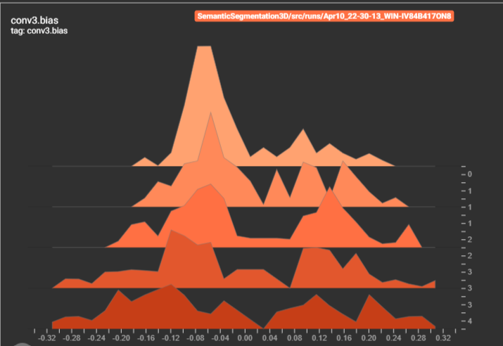
</p>

### SparseConvTranspose Layer Biases

<p align="center">
  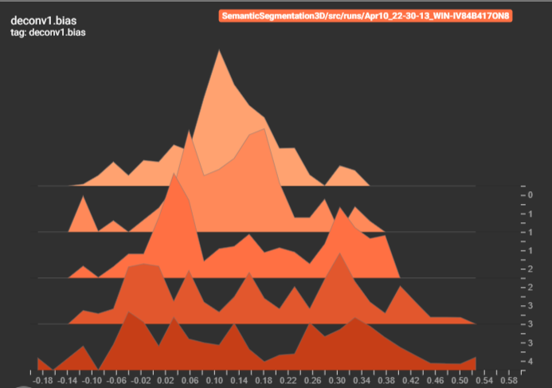
  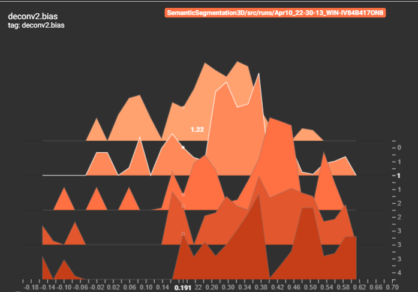
  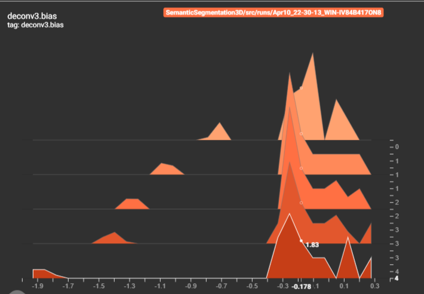
</p>

### Tensorboard Loss, Number of Correct Classes, Accuracy,  
<p align="center">
  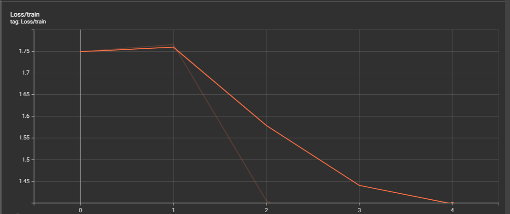
  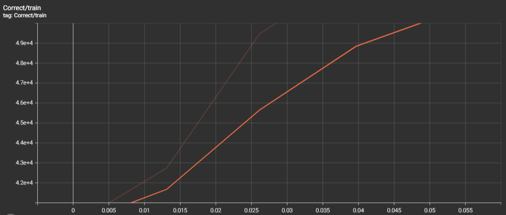
  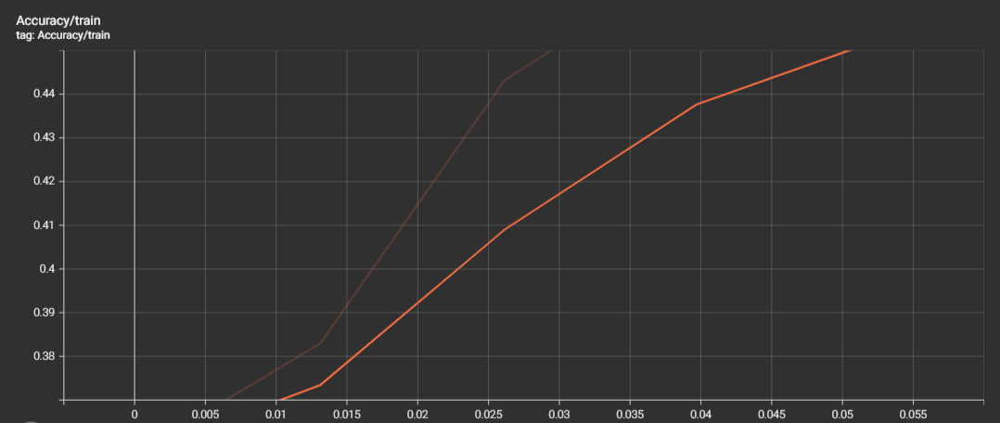
</p>

## Model Adding

Finally, after having our model ready, we can put it inside Open3D-ML library. By following the [Adding new 3D model](https://github.com/isl-org/Open3D-ML/blob/master/docs/howtos.md) link from Open3D-Ml Github repo, I wrote a `model_adding.py` that uses the base model and the model structure of this task as I have written in `semseg_model.py`. Of course, if added to the Open3D-ML library's models folder, the name of the file should change accoring to the Model, like `SemanticSegmentation3D.py`, but for the sake of this task, to be more understandable I call it `model_adding.py` to note that its content is for adding to the Open3D-Ml library models folder, based on  [Adding new 3D model](https://github.com/isl-org/Open3D-ML/blob/master/docs/howtos.md).

